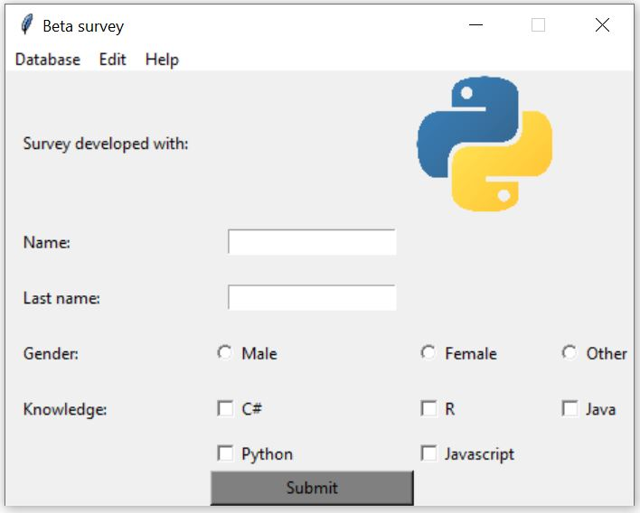
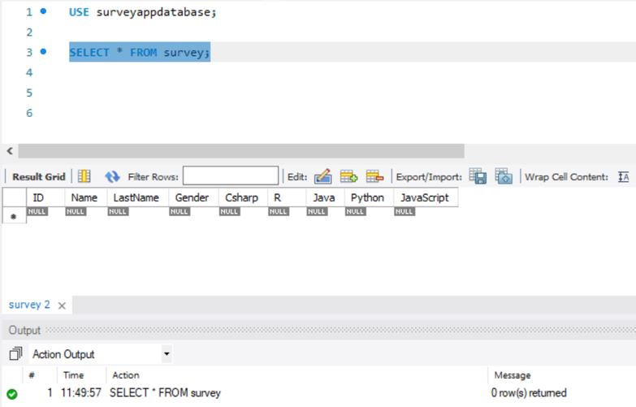

# Python
I started learning Python by myself and this is my first desktop application I've done to train the basics of Python. The project is pretty simple, it just has the Python file and an image.

The final result is shown below:

This project uses Python 3. Additionally, tkinter and pymysql modules are used. It simulates a survey, which doesn't make sense for a desktop application but a web application, however, the purpose of this project is to train the basics of Python I've learned. The app is able to create a database and stores all the data it receives from different users, some MySQL queries have been used for this and the insert statement is crafted with a parameterized query to avoid SQL injections.

Example of the insert query execution:

